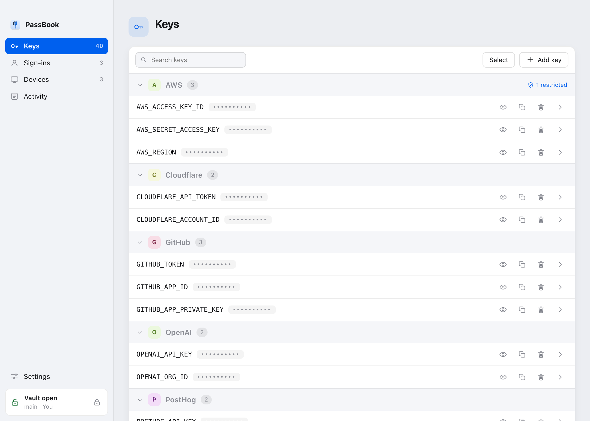
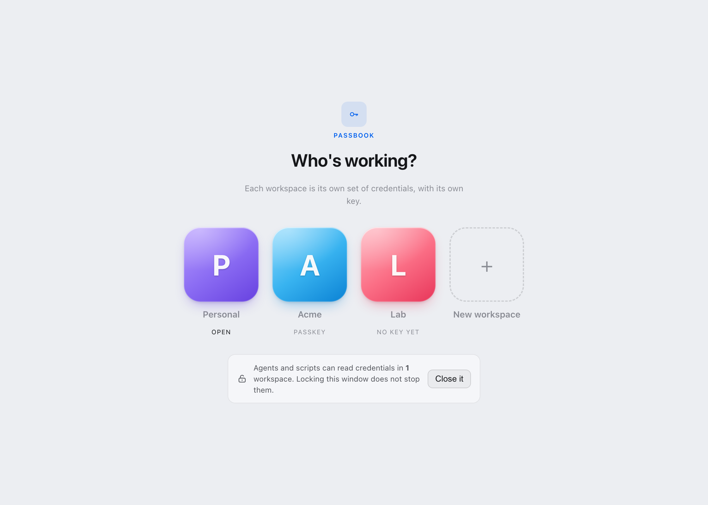
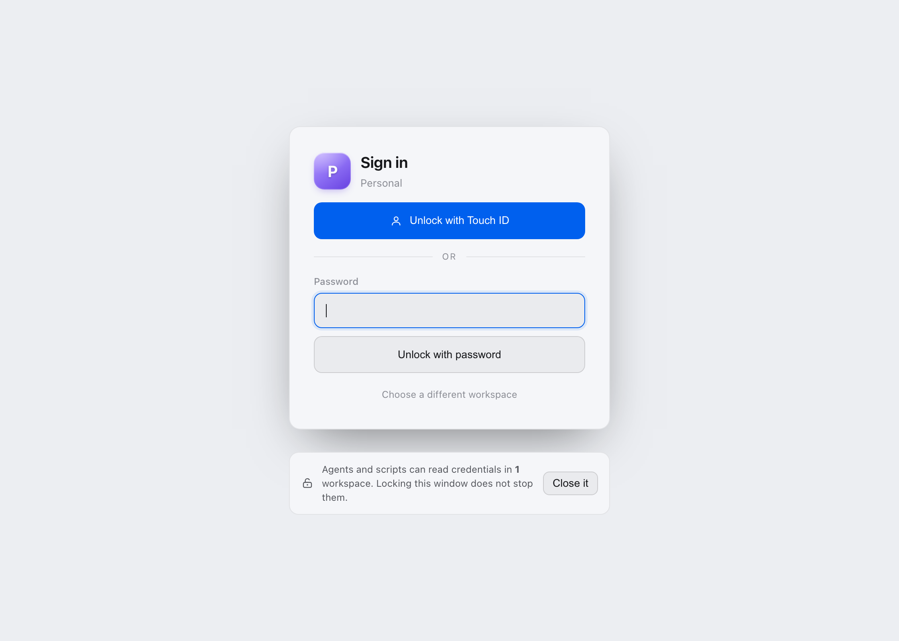
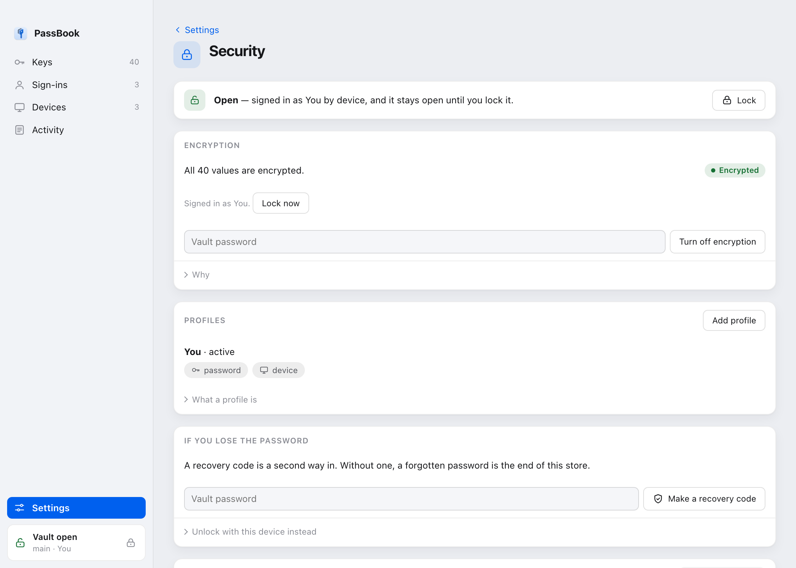
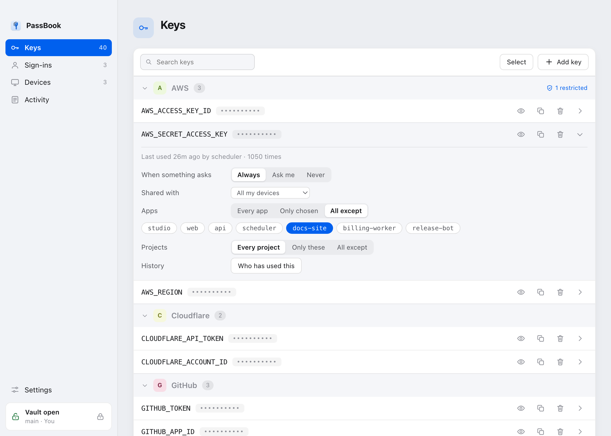
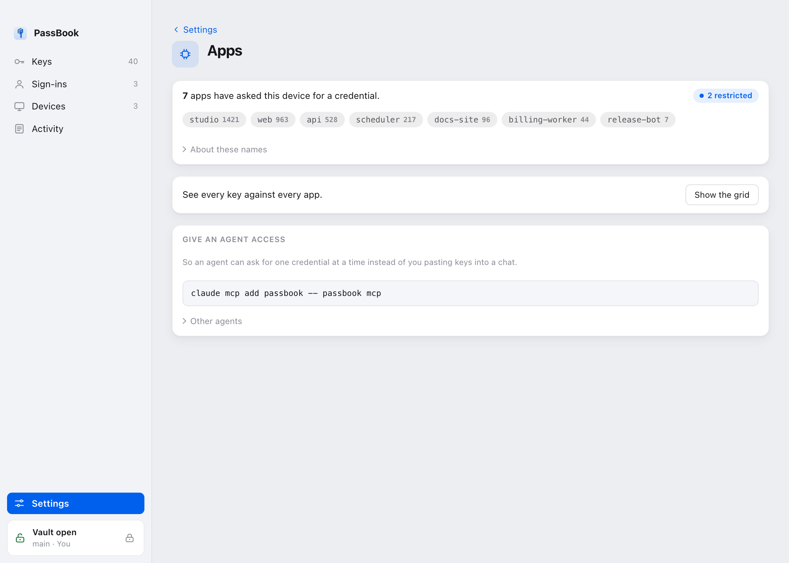
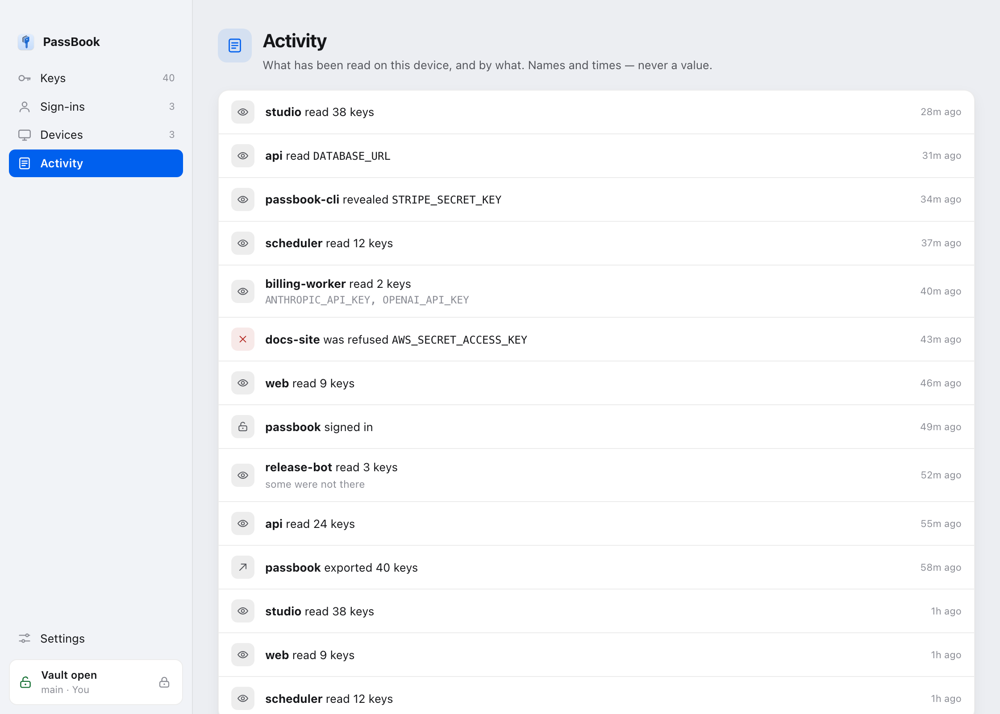
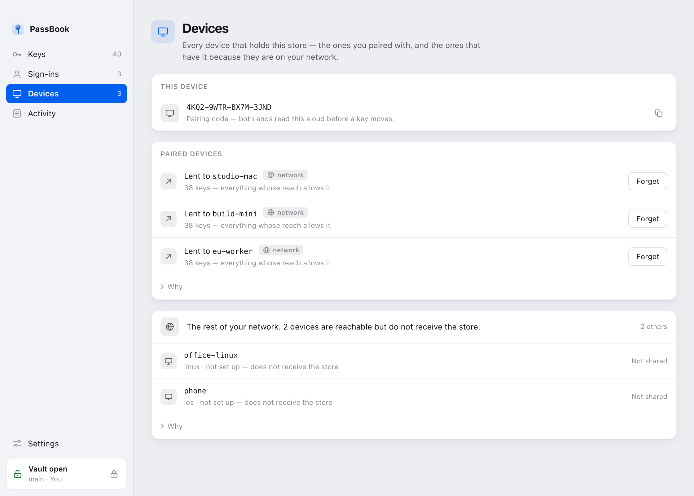
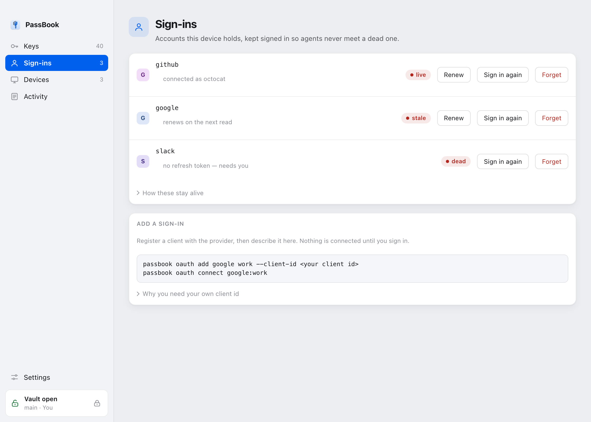
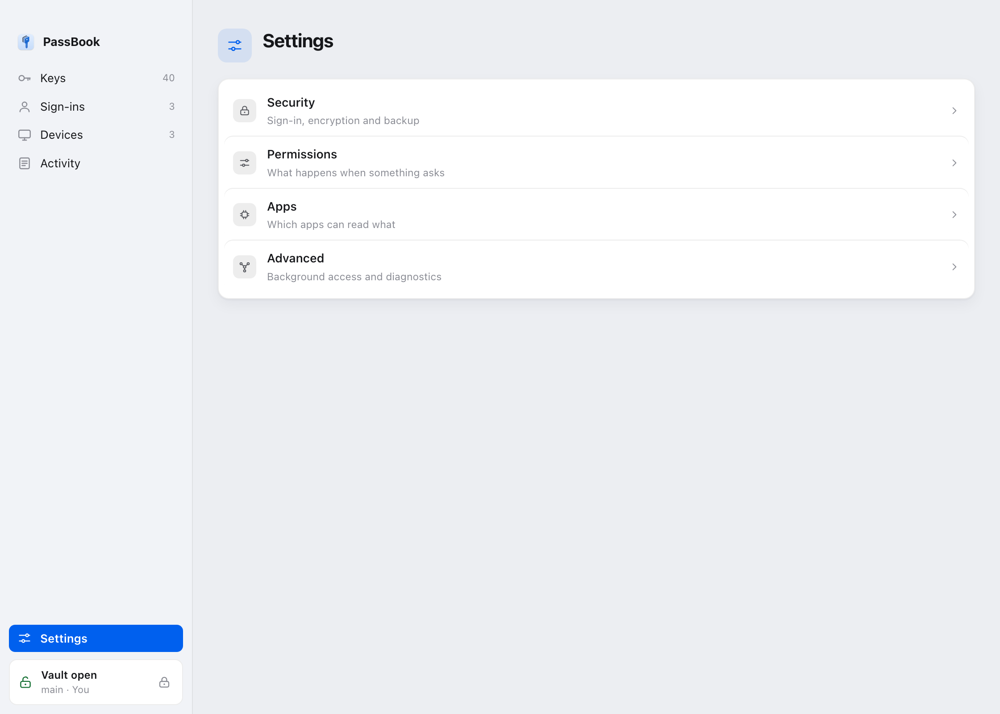

<h1 align="center">
  
</h1>

<p align="center">
  <a href="https://github.com/LiamVisionary/passbook/actions/workflows/ci.yml"></a>
  <a href="https://github.com/LiamVisionary/passbook/releases/latest"></a>
  <a href="LICENSE"></a>
</p>

**One credential store per machine, shared by every app that opts in.**

Ship three apps and you get three credential stores. The same OpenAI key gets
pasted three times, revoked in one place, and still works in the other two.
PassBook fixes that by agreeing on a path instead of building a sync protocol.

Every app resolves the same file by the same rule. So provisioning and linking
are the same operation. The first app that needs credentials creates the store,
and every app installed after it finds that file and adopts it. Nothing forks,
so nothing has to be merged.



There is a desktop app and it holds no logic of its own. Every question it
answers goes through the same command line an agent or a script would use. What
you see here, you can do from a terminal.

---

## Contents

- [Install](#install)
- [Use it](#use-it)
- [Workspaces](#workspaces)
- [Signing in](#signing-in)
- [Encryption](#encryption)
- [Who can read what](#who-can-read-what)
- [Activity](#activity)
- [Devices](#devices)
- [Sign-ins that stay alive](#sign-ins-that-stay-alive)
- [Agents](#agents)
- [The broker](#the-broker)
- [Backup](#backup)
- [What it does not claim](#what-it-does-not-claim)
- [Reference](#reference)

---

## Install

Grab the app from [releases](https://github.com/LiamVisionary/passbook/releases/latest),
or install the command line:

```bash
./install.sh
```

That is the whole setup. It finds a Python, installs the commands, provisions
the store, and prints what it decided.

Encryption and linking need `cryptography`, which is not in the standard
library. On Homebrew, Debian and Ubuntu you cannot install it into the system
Python, because all three mark theirs externally managed and refuse (PEP 668).
So setup does not ask you to. It provisions its own interpreter under
`~/.hivemindos/passbook-runtime` and points the commands at that. It touches
nothing the machine already relies on and needs no root.

If that step cannot run, because there is no network or no build tools, setup
still finishes. Everything except encryption and linking works, it says so
plainly, and `passbook install` picks up where it left off later.

Already have `uv` or `pipx`? Same job:

```bash
uv tool install passbook
```

Or copy `passbook.py` straight into a project. One file, no dependencies, no
install step. That copy gets the store, the precedence rule and the scoping.
Encryption and linking are the parts that need the runtime.

### Set it up with an agent

Paste this into Claude Code, Codex, Cursor, Copilot, anything that can run
commands on your machine. It installs PassBook, wires the agent into it, and
leaves the machine working.

````text
Set up PassBook on this machine for me, end to end.

PassBook is one credential store per machine, shared by every app that opts in,
so an API key gets pasted once instead of once per project. Repo:
https://github.com/LiamVisionary/passbook

Do all of this, and tell me what you find at each step:

1. Install it. Prefer a tool installer so it gets its own environment:
   uv tool install passbook   (or pipx install passbook, or ./install.sh)
2. Run `passbook status` and tell me where the store is and how many keys it holds.
3. Encrypt it with `passbook secure` if it is not encrypted already. Tell me
   which keys it leaves readable and why.
4. Add yourself over MCP: `claude mcp add passbook -- passbook mcp`
5. Show me `passbook apps` so I can see what has asked for a credential.
````

---

## Use it

```python
import passbook

passbook.ensure(app="my-app", name="My App")   # idempotent: creates or adopts
passbook.apply()                               # fill in what the process lacks
```

```js
import { ensure, apply } from './passbook.mjs';
ensure({ app: 'my-app', name: 'My App' });
apply();
```

Then read credentials from the environment as you already do. The store is a
fleet wide **default**, never an override. A value exported into the process, or
set in the project's own `.env`, always wins.

For an app that should ask for what it needs rather than inherit everything:

```python
key = passbook.request(["OPENAI_API_KEY"], app="my-app", reason="image render")
```

Both read the same file today, so `request` grants no less than `apply` does.
The difference is that an app written against `request` can be moved behind a
broker that says no to a key it was never granted. An app written against
`apply` cannot.

### On the command line

```bash
passbook-check OPENAI_API_KEY          # set or missing, never the value
passbook-add OPENAI_API_KEY            # prompts without echo
passbook-run -- npm run dev            # run with the store loaded as a base
```

Use the bare `passbook-add KEY` prompt. A value typed as `KEY=value` lands in
shell history and is briefly visible to `ps`.

---

## Workspaces

A machine can hold several stores, and each one has its own key.

That second half is the part that matters. A workspace is not a folder. It is a
set of credentials plus the thing that opens them, so picking a workspace and
picking whose key you are holding is one decision, not two. Sign in to Personal
and the Acme keys stay encrypted, on the same disk, in the same second.



Values sealed by one workspace cannot be read by another. A new workspace starts
able to open nothing, which is the correct starting point for anything holding
somebody else's credentials.

```bash
passbook workspace                       # what is here, and which is active
passbook workspace use acme              # switch
passbook signin --workspace acme         # open that one, leave the rest shut
passbook signout --workspace acme        # shut it, leave the rest open
```

Reads layer the machine store, then the workspace store, so a workspace inherits
the machine's keys and a more specific value wins. **Writes go to the
workspace.** That is the half people get bitten by. A key added while you are
scoped to a client's workspace must not appear machine wide, or `"inherit":
false` would be decoration.

```json
{"activeWorkspaceId": "acme", "workspaces": [
  {"id": "main"},
  {"id": "acme", "inherit": false}
]}
```

`"inherit": false` cuts the machine store out entirely. Use it for anything
holding someone else's credentials. Siblings never see each other either way.

`HIVE_WORKSPACE` wins for a process that sets it. Otherwise the active workspace
comes from HivemindOS's own `workspaces.json`, and PassBook writes that same
file rather than keeping a copy. Two records of which workspace is active would
disagree the moment either app changed one, and each would go on showing the
truth as it knew it.

Both reference implementations resolve this identically and a test asserts it
across runtimes. That is not tidiness. If they diverged, a Node process and a
Python process on one machine would see different keys, and the same provider
would work in one and fail in the other with nothing to point at.

---

## Signing in

The store is encrypted. Something has to open it, and there are three ways.



| | Where it works | What it is |
|---|---|---|
| **Password** | everywhere | `hashlib.scrypt` over the password you chose |
| **Touch ID** | the desktop app, on a Mac with biometrics | LocalAuthentication, in front of the device factor |
| **Passkey** | a browser | a WebAuthn PRF secret |

Be exact about the last two, because the difference is not obvious and it cost
us an afternoon.

**Passkeys need a browser.** A passkey is bound to a domain and the ceremony
runs in a browser. A desktop window is neither. Measured from inside PassBook's
own webview, WebAuthn's `isUserVerifyingPlatformAuthenticatorAvailable()`
answers false, and it keeps answering false when the window is served over
`http://localhost` and when the app is signed with a Developer ID. So the
desktop app does not offer passkey enrolment. A passkey made in a browser opens
the same vault.

**Touch ID is what the desktop app offers instead.** It is LocalAuthentication,
the native API, in front of the device factor PassBook already had. It needs no
domain, no browser and no entitlement.

```bash
passbook signin              # opens the vault, starts the broker if none is running
passbook signin --for 8h     # or put a clock on it
passbook signout             # shut it
```

**A sign-in does not expire on its own.** It used to close after eight hours,
which is a rule about a person at a desk and the wrong rule for a machine
running agents overnight. A vault that locks itself at four in the morning stops
the work rather than protecting it, and what people do about that is stop
encrypting the store. Ask for `--for 8h`, `--for 1d`, anything up to a week if
you want a clock.

Leave `--for` off and the workspace keeps whatever length it is already on. That
matters more than it sounds: signing in a second time, to switch profile or
right after adding Touch ID, used to quietly turn a session somebody had boxed
to an hour into one that never ends.

### Locking the window is not locking the vault

They are two different decisions and the app keeps them apart.

**Lock** closes the window. It asks for a factor to get back in, and it survives
quitting the app. It does not touch the broker, so agents keep working. That is
the point. Closing your laptop lid should not stop the overnight run.

**Agent access** is the other lock, and it lives on the lock screen where
somebody is already thinking about what they leave open. Closing it drops the
data key and nothing on the machine can read a credential until you sign in.

The window lock stops a person at your keyboard. It does not stop code running
as you, and nothing here could. That code can read the store directly.

---

## Encryption

By default the store is a plaintext file that anything running as you can read.
One command changes that:

```bash
passbook secure
```

It creates a profile, encrypts every value, starts the broker and signs you in.
From then on the file holds ciphertext, and the key that opens it exists only
inside a signed-in broker process. Never on disk, never handed back to a caller.



```bash
passbook unseal        # put everything back in the clear, permanently
```

The way out is as visible as the way in. An encryption you cannot reverse is one
nobody turns on.

### How it holds the key

A value is encrypted under a per-profile **data key** that is never written
down. The data key is wrapped by one or more factors, and opening the vault
means satisfying one of them. Changing a password rewraps 32 bytes. It does not
re-encrypt your values.

Everything in the critical path is `hashlib` and AES-GCM. No Keychain, no DPAPI,
no libsecret. So the vault opens the same way on macOS, Windows and Linux.

The OS keystore is the exception, and it is opt-in. It hands the opening key to
anything running as your account, which is the exact property the rest of this
removes. Touch ID puts a person in front of it for the window, and that is a
lock on the window rather than on the key.

### What it leaves readable

Values behind a framework's public prefix (`NEXT_PUBLIC_`, `VITE_`, `REACT_APP_`,
`PUBLIC_`, `EXPO_PUBLIC_`, `GATSBY_`, `NUXT_PUBLIC_`) are left in the clear. A
build inlines them into a browser bundle long before anyone could sign in, so
encrypting one protects nothing and breaks the build. `secure` prints every key
it is leaving readable, and why, before it does anything.

Add your own with `--skip`, for a feature flag some boot hook reads.

### If you forget the password

A vault wrapped by one password is one forgotten password away from gone.

```bash
passbook recovery          # shows a code, once
passbook signin --recovery
```

The code is about 150 bits in six groups, and PassBook keeps only enough to
check it, so it cannot show it to you twice. It reads back however you type it:
lower case, hyphens dropped, `O` for `0`, `I` or `L` for `1`. Refusing that
would be refusing someone the only copy of their vault over typography.

---

## Who can read what

A store with a few hundred keys is a flat list nobody reads and a policy nobody
reviews. Four bounds exist for that, and each one answers a different question.

Open a key in the app and all four are on the row.



### Groups arrange the store

Inferred from the names you already use, because any scheme that needs you to
tag three hundred keys by hand never gets finished.

```bash
passbook group            # what is in here, arranged
passbook group set "Payments" STRIPE_SECRET_KEY STRIPE_WEBHOOK_SECRET
```

`OPENAI_API_KEY` and `OPENAI_BASE_URL` are already telling you they belong
together. A family becomes a group once two keys share it. A group of one is a
flat list wearing a costume. Anything you set by hand wins.

### Scopes say how far a key reaches

```bash
passbook scope set CLIENT_SECRET --workspace    # this workspace only
passbook scope set OPENAI_API_KEY --machine     # every workspace here
passbook scope set DEPLOY_KEY --tailnet         # and lendable to linked devices
```

**Only the workspace a key came from can change its reach.** A workspace you
share a key with can read it and can see the scope. It cannot pass the key on.
Otherwise sharing would hand over the power to share onward, which is not
sharing, it is giving it away.

`tailnet` is a permission, not a sync. Widening a scope makes a key eligible to
be lent and does not move it anywhere by itself.

### Audiences say who a key is for

```bash
passbook apps                                     # every restricted key
passbook apps set ADMIN_TOKEN --only passbook-app
passbook apps set TRADING_KEY --block claude-code cursor
passbook apps set ANALYTICS_KEY --everyone        # back to the default
```

A caller says who it is with `--app`, or by setting `PASSBOOK_APP` once. Every
PassBook call in that process tree carries it, including whatever `passbook run`
starts, so an agent harness names itself once instead of threading a flag
through code it does not own.

An **app** here is whatever declared a name when it asked. A background daemon,
a command line, a project's build, an agent over MCP. They all land in the same
field, so the surfaces call the whole set apps rather than claiming every one of
them is an agent.

Every key is readable by every app until you say otherwise. An audience is a
**bound**, not a preference: a key that excludes an app is refused for that app
whatever the mode, unlock or approval says. That is what makes it safe to hand
someone the shape of their whole store and let them fence off the three keys
that matter.



### Projects limit a key to a checkout

An agent is one process that moves between checkouts, and its name does not
change when it does. So an agent trusted with the deploy key carries that trust
into every repository you point it at, including one whose README contains an
instruction somebody else wrote.

```bash
passbook projects set DEPLOY_KEY --only acme
passbook projects set SCRATCH_KEY --without prod
passbook projects set DEPLOY_KEY --every
```

A project is `PASSBOOK_PROJECT`, else the basename of the nearest git root. It
is a claim its caller makes, exactly like an app name. It stops a confused agent
reaching across checkouts. It does not stop someone who already runs code as
you.

One asymmetry worth knowing. A caller that names **no** project is not on an
`--only` list, because otherwise running outside any checkout would be the way
around every project rule. A `--without` list still lets it through, since no
project named is not the named one.

### Before a key changes

Everything above is about reads. These are about changes.

```bash
passbook confirm delete          # removing a key now waits for you
passbook confirm modify
passbook confirm add --off
```

All three are off by default, because a machine where every `passbook add` waits
on a dialog is one where people stop using `passbook add`. Turned on, they give
the store a property its encryption does not: **its contents cannot change
quietly.** Encryption stops a stolen laptop reading your keys. This is what
catches an agent helpfully fixing one.

They are separate toggles because they are different questions. Wanting to be
told before a credential is *replaced*, the change that breaks things silently
because nothing errors and it just starts talking to the wrong account, is not
the same as wanting a dialog for every new key.

A change that asks waits in the window and raises a system notification. Nothing
is written until you answer, and two things count as no. **No broker running**
refuses the change rather than letting it through, because a toggle whose
enforcement disappears with a daemon is not a toggle. **Nobody answering** times
out and the key is left alone.

---

## Activity

Every read, hash chained. Key names and times, never a value.



The rows are in GitLawb's proof format, so GitLawb's own verifier reads them.
Verify from the app or the command line:

```bash
passbook history                 # what has been read
passbook history --verify        # re-hash the chain and say whether it holds
```

Tamper evident, not tamper proof. It does not prevent an access. It makes one
impossible to hide.

---

## Devices

A second device borrows **named keys** from the first, for a stated period,
after a human has confirmed a pairing code. Not the store. Named keys.



```bash
passbook-link request
passbook-link approve <token> --keys OPENAI_API_KEY --confirm <code>
passbook-link accept <envelope> --confirm <code>
```

Both ends confirm a code, for different reasons. Approving decides who may
*read* your keys. Accepting decides whose keys you will *run with*. Anyone who
saw a pairing token knows the public key and could seal a valid envelope
carrying their own value for a real key, pointing at a proxy that logs
everything. So a device you have not accepted from before is confirmed once, and
after that its identity is bound.

Four properties it is built for:

- **Membership is not authorization.** Same tailnet, same LAN, same account,
  none of it grants anything. There is no listening service here on purpose, so
  reachability decides nothing.
- **The pairing code is the second factor.** A token could be intercepted and
  swapped, and that attack is invisible if the only check is whether it arrived.
- **Values are sealed to the device.** The envelope is encrypted to the far
  device's key with an ephemeral exchange, so it is safe on any transport.
  Whoever carries it learns nothing.
- **A grant is narrow and it expires.** Named keys, one workspace, an expiry,
  and a nonce that cannot be replayed. It is a UCAN shaped capability, signed,
  and the signed half decides what lands.

```bash
passbook-link revoke <did>
```

Revoking stops the next envelope. It cannot unsend what was already delivered,
so `revoke` prints the keys that must still be **rotated at the provider**.
Nothing can do better than that. Anything claiming to is lying about what a
credential is.

Accepted keys land in the receiving device's *active* workspace, so a borrowed
key arrives already scoped rather than machine wide.

---

## Sign-ins that stay alive

Some things are not an API key but a **sign-in**, and the difference that
matters is that a sign-in has a clock on it. A store holding

    OPENAI_OAUTH_ACCESS_TOKEN
    OPENAI_OAUTH_REFRESH_TOKEN
    OPENAI_OAUTH_EXPIRES_AT

sees three unrelated strings. It cannot tell you the grant expired and cannot do
anything about it, so the access token an app reads is dead an hour after
somebody last opened whatever refreshes it. It surfaces as a puzzling 401
somewhere else entirely.



```bash
passbook oauth add google work --client-id <the client you registered>
passbook oauth connect google:work      # opens the browser, catches the callback
passbook oauth                          # what is connected, and for how long
```

**The broker renews it on the way past.** When anything reads the access token,
the broker checks the clock, refreshes if it is close, writes the new tokens
back, and hands over one that works. That is why this lives here rather than in
an app. The broker runs whenever anything on the machine can read a credential
at all, so a grant does not die just because the app that created it is closed.

The tokens live in the store under ordinary key names, so they are encrypted
with everything else, held to the same audiences, and in the same record. There
is no second vault and no second set of rules.

Two things worth knowing. **No vendor's client id ships with PassBook**, because
a grant that borrows one is a matter between you and that vendor's terms.
And **a refresh token is worth more than most API keys**, because it mints new
access tokens on demand and usually outlives them by months. If you were
undecided about `passbook secure`, holding sign-ins is the argument for it.

---

## Agents

PassBook speaks MCP over stdio, so an agent can list what exists and ask for one
credential at a time, checked and recorded, instead of you pasting keys into a
chat.

```bash
claude mcp add passbook -- passbook mcp
```

```json
{
  "mcpServers": {
    "passbook": { "command": "passbook", "args": ["mcp"] }
  }
}
```

The Agent Client Protocol passes MCP servers through to the agent, so this one
server reaches ACP editors too without a second thing to configure.

| Tool | Returns |
| --- | --- |
| `list_credentials` | Names, groups, and whether *this* agent may read each. Never values. |
| `get_credential` | One value, by name, checked against policy and recorded. |
| `check_credentials` | Whether named keys exist, without reading them. |
| `list_sign_ins` | OAuth accounts and whether each is still live. Never a token. |
| `get_oauth_token` | A live access token, renewed first, so refresh is never the agent's problem. |
| `vault_status` | Whether the store is encrypted and currently unlocked. |

**The agent's name is a claim.** It arrives in the MCP handshake and nothing
proves it. It is used for policy and for the record, never as authentication.
What it buys is the common case rather than the adversarial one. An agent asks
for three keys instead of helping itself to your environment, you can see which
agent asked for what, and a key that is none of an agent's business can be
marked so.

---

## The broker

Without a broker, every app records its own reads, so the record is missing
exactly the apps least likely to bother. The broker closes that and holds each
app to the keys its policy names.

```bash
passbook broker start
passbook broker policy --learn --mode deny
```

It starts in **audit** mode. Nothing is refused, everything is recorded. Once
your apps have run for a while, let the record write the policy rather than
guessing at one. Read it before trusting it, because anything an app has not
needed yet is not in there.

### What it does not do

It does not stop a determined attacker. Three reasons, all deliberate:

- anything running as you can connect to the socket and claim to be any app,
  and any secret that could prove otherwise would sit on the same disk the
  attacker can already read
- the store file is still there to be read directly
- stopping the broker restores full access, and every app keeps working

That last one is a choice. A broker that could take the machine down by stopping
would not survive a real week.

So read `denied` in the record as *an app asked for something it is not set up
to need*. A dependency doing more than you expected, or a policy to widen. Never
as *an intruder was turned away*.

What it genuinely buys is a **complete record** instead of a voluntary one, and
**least privilege for honest code**. The common accident is not malware. It is a
tool that reads the whole environment because that was the easy call, and then
logs it or ships it in a crash report.

---

## Backup

```bash
passbook export ~/Desktop/store.pbx              # encrypted, the default
passbook export ~/store.asc --gpg                # armoured GPG
passbook export ~/store.env --plain --i-understand
passbook import ~/Desktop/store.pbx --dry-run    # say what would change
passbook import ~/Desktop/store.pbx
```

Three shapes because the reasons differ. **Encrypted** is scrypt over a
passphrase you choose and AES-GCM over the body, and the other end needs nothing
but PassBook. **GPG** is for machines already keeping secrets that way.
**Plain** is readable `KEY=value`, sometimes exactly what you need moving to a
machine that has no PassBook yet, and never safe to leave lying around.

Import works out which shape a file is by looking at it, because the person
importing it did not choose its shape and should not have to describe it.

Three refusals:

- A plaintext export needs `--plain` **and** `--i-understand`. Export reads like
  back up, and a plaintext backup is a copy of every credential you own.
- Nothing writes an encrypted value out still encrypted. An export is a
  decryption. It goes through the broker like any other read, is held to the
  same policy, and lands in the record under its own op.
- A wrong passphrase and a damaged file give the same answer. Telling them apart
  would be an oracle.

An import never overwrites a key the store already holds. It says which ones it
kept.

---

## What it does not claim

**Encryption protects the store at rest.** A stolen laptop, a backup, a synced
home folder, a copy that ends up in a repo. It does not stop code running as you
from reading a key. Nothing that hands values to your own processes can.

**The broker makes reads recorded and narrow, not impossible.** It is an audit
boundary and a blast radius limiter. Calling it an access control would be a lie
that someone eventually relies on.

**The record is tamper evident, not tamper proof.** It does not prevent an
access, it makes one impossible to hide.

**The window lock stops a person, not a process.** It asks for a factor and it
survives quitting the app. Anything already running as you can read the store
without being asked.

Making refusals real needs the operating system to vouch for the caller. A code
signed binary and a keychain ACL on macOS, something different again elsewhere.
That is a signing and distribution project, not a file in here.

### What it will not do

- **Print a value.** Every status, diagnostic and error surface returns key
  *names*. There is no read back path for a stored value, including for its
  owner.
- **Overwrite a key you did not ask it to.** Another app on the machine is
  probably using it.
- **Create a second store.** If an implementation seems to need one, it has
  misread the spec. That includes inside a macOS App Sandbox, where `~`
  silently becomes a private container. PassBook detects that and refuses,
  because the alternative looks like missing credentials rather than a
  packaging bug.

---

## Reference

### What you need installed

Nothing, beyond the one file. An app that vendors `passbook.py` reads the store
on its own. No daemon, no CLI, no PassBook application.

| | Needed for | Without it |
|---|---|---|
| the store implementation | anything at all | — |
| `passbook install` | the commands on your PATH | apps still work, you just have no CLI |
| the broker | policy enforcement, a complete record | reads fall back to the files |
| a policy | asking, windows, unlocks | everything resolves as it always did |
| the app | the strongest approval surface | approve from the CLI |

A policy is enforced by the broker, so writing one cannot strand a machine that
has no broker. A brokerless read pays no socket timeout, so the common case
never subsidises the rare one. There are tests for each of those, because they
are the sort of promise that erodes one convenience at a time.

### The files

| | |
|---|---|
| `SPEC.md` | the standard: layout, format, precedence, conformance |
| `passbook.py` | Python 3.9+ reference implementation, no dependencies |
| `passbook.mjs` | Node 18+ twin, byte compatible with the Python side |
| `passbook_vault.py` | profiles, sign-in, and encryption that travels |
| `passbook_keystore.py` | per-OS key storage for unattended machines |
| `passbook_access.py` | which app may read which key, and when |
| `passbook_catalog.py` | groups, audiences, and the access matrix |
| `passbook_mcp.py` | an MCP server, so agents can find all this |
| `passbook_oauth.py` | sign-ins that stay alive, renewed on read |
| `passbook_broker.py` | one door for reads, and a record of them |
| `passbook_stamp.py` | a tamper evident record of who read what |
| `passbook_link.py` | lending named keys to a second device |
| `passbook_peer.py` | asking the kernel who is calling (macOS) |
| `bin/passbook` | the command line |
| `app/` | the desktop app, which holds no logic of its own |
| `app/src-tauri/biometric/` | Touch ID, behind a small safe API |
| `AGENT_PROMPT.md` | paste into a coding agent to put a project on PassBook |

### PassBook and the hive env

On a machine running HivemindOS, the store PassBook resolves **is** the hive env
at `~/.hivemindos/.env`, the same file `hive-env-check` and `hive-env-run`
already use. PassBook does not wrap it, shadow it, or migrate it. The commands
are interchangeable:

```bash
passbook-check ANTHROPIC_API_KEY && hive-env-check ANTHROPIC_API_KEY
```

The names differ because they answer different questions. Hive env names the
store on a Hive machine. PassBook names the standard, and is kept free of Hive
branding so an unrelated project can adopt it without adopting a product.

### Settings

Everything that is about how the machine works rather than what is in it lives
one press away.



---

## License

Apache License 2.0. See [LICENSE](LICENSE) and [NOTICE](NOTICE).

Permissive on purpose. `passbook.py` is meant to be copied into a project as a
single file, and a copyleft licence would make the thing the spec asks you to do
legally awkward. The patent grant matters here too, because this is security
code.

## A note on the name

Apple shipped an app called Passbook between iOS 6 and iOS 8, renamed Wallet in
2015, and holds trademarks around it. This project is a developer tool for
machine credentials rather than a consumer wallet, and is not affiliated with,
endorsed by, or connected to Apple Inc. in any way. If that turns out to be a
problem, the name is the easiest part of this to change.
