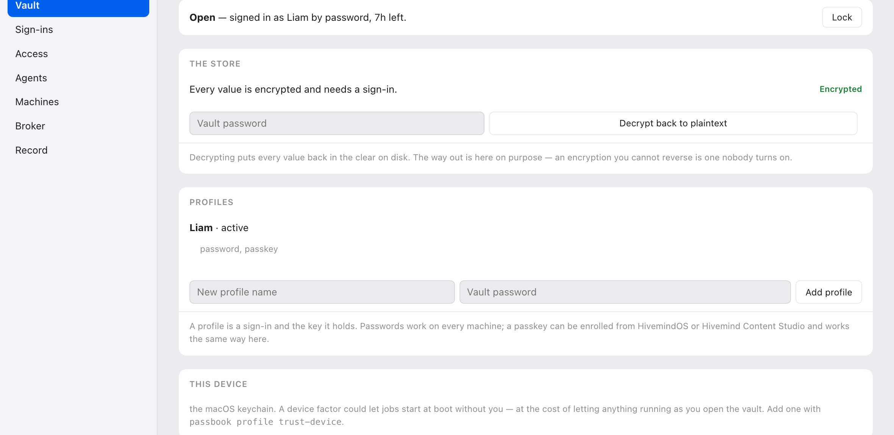
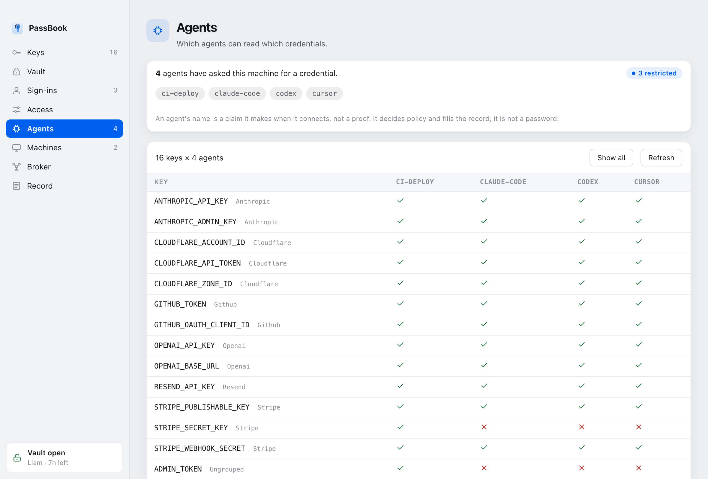

# PassBook

[](https://github.com/LiamVisionary/passbook/actions/workflows/ci.yml)
[](LICENSE)

**One credential store per machine, shared by every app that opts in.**

Ship three apps and you get three credential stores. The same OpenAI key gets
pasted three times, revoked in one place, and still works in the other two.
PassBook fixes that by agreeing on a path instead of building a sync protocol.


There is a desktop app, and it holds no logic of its own — every question it
answers goes through the same command line an agent or a script would use. What
you see below, you can do from a terminal.

Because every app resolves the same file with the same rule, **provisioning and
linking are the same operation**. The first app that needs credentials creates
the canonical store; every app installed after it finds that file and adopts it.
Nothing forks, so nothing ever has to be merged.

- `SPEC.md` — the standard: layout, format, precedence, conformance
- `passbook.py` — Python 3.9+ reference implementation, no dependencies
- `passbook.mjs` — Node 18+ twin, byte-compatible with the Python side
- `passbook_vault.py` — optional: profiles, sign-in, and encryption that travels
- `passbook_keystore.py` — optional: per-OS key storage for unattended machines
- `passbook_access.py` — optional: which app may read which key, and when
- `passbook_catalog.py` — optional: groups, audiences, and the access matrix
- `passbook_mcp.py` — optional: an MCP server, so agents can find all this
- `passbook_oauth.py` — optional: sign-ins that stay alive, renewed on read
- `passbook_broker.py` — optional: one door for reads, and a record of them
- `passbook_stamp.py` — optional: a tamper-evident record of who read what
- `passbook_link.py` — optional: lending named keys to a second machine
- `passbook_peer.py` — optional: asking the kernel who is calling (macOS)
- `passbook_seal.py` — superseded by `passbook_vault.py`; still reads v1 stores
- `bin/passbook` — the command line
- `app/` — a native desktop front end (Tauri), which holds no logic of its own
- `AGENT_PROMPT.md` — paste into a coding agent to put a project on PassBook

## Set it up with an agent

Paste this into Claude Code, Codex, Cursor, Copilot, ChatGPT — anything that can
run commands on your machine. It installs PassBook, wires the agent into it, and
leaves the machine in a working state.

````text
Set up PassBook on this machine for me, end to end.

PassBook is one credential store per machine, shared by every app that opts in,
so an API key gets pasted once instead of once per project. Repo:
https://github.com/LiamVisionary/passbook

Do all of this, and tell me what you find at each step:

1. Install it. Prefer a tool installer so it gets its own environment:
      uv tool install "passbook @ git+https://github.com/LiamVisionary/passbook.git"
   or, if uv is not available:
      pipx install "passbook @ git+https://github.com/LiamVisionary/passbook.git"
   Do NOT pipe a remote script into a shell for this — it is a credential
   manager, and I want to be able to read what I installed.

2. Confirm it works and show me the output of:
      passbook status
   It prints where the store is, how many keys it holds, and which apps use it.
   It never prints a value.

3. If the store is empty, do not invent keys. Tell me which ones this project
   needs by name, and I will add them with `passbook add NAME` (which prompts
   without echoing).

4. Register PassBook as an MCP server for yourself, so you can read credentials
   through a checked, recorded door instead of me pasting them into the chat.
   The command is `passbook mcp` and it speaks MCP over stdio. Add it to
   whichever config file you use — figure out the right one for yourself, and
   show me the change before you make it. For most clients it looks like:
      {"mcpServers": {"passbook": {"command": "passbook", "args": ["mcp"]}}}

5. Restart yourself if that is what it takes to load the server, then call
   `list_credentials` and show me the groups and the count. Do not call
   `get_credential` yet.

6. Run `passbook oauth` and tell me whether any account sign-ins exist and
   whether they are still live. Do not connect anything without asking me.

7. Tell me, in one short list:
   - how many credentials this machine holds
   - which groups they fall into
   - which sign-ins are connected, and any that have expired for good
   - anything you think should be restricted to fewer agents, and why

Rules while you do this:
- Never print a credential value into the chat, a file, a commit, or a log.
- Never run `passbook reveal` unless I ask for that exact key.
- If anything is refused, tell me what it said instead of working around it.
````

Once that is done, the agent asks for credentials by name and every request is
checked against your policy and recorded. You can see who asked for what with
`passbook access`, and who is allowed what with `passbook matrix`.

### Wiring it up by hand

`passbook mcp` speaks MCP over stdio, so the config is the same shape everywhere:

```json
{
  "mcpServers": {
    "passbook": { "command": "passbook", "args": ["mcp"] }
  }
}
```

Claude Code will also take it in one line:

```bash
claude mcp add passbook -- passbook mcp
```

The Agent Client Protocol, which sits between editors and agents, passes MCP
servers through to the agent — so this one server reaches ACP editors too
without a second thing to configure.

### What the agent gets

| Tool | Returns |
| --- | --- |
| `list_credentials` | Names, groups, and whether *this* agent may read each. Never values. |
| `get_credential` | One value, by name, checked against policy and recorded. |
| `check_credentials` | Whether named keys exist, without reading them. |
| `list_sign_ins` | OAuth accounts and whether each is still live. Never a token. |
| `get_oauth_token` | A live access token for one sign-in — renewed first, so refresh is never the agent's problem. |
| `vault_status` | Whether the store is encrypted and currently unlocked. |

On connect the server also hands the agent instructions telling it to list
before reading, ask only for what it needs, and never print a value. That is a
nudge for honest agents, not a control — see below.

**The agent's name is a claim.** It arrives in the MCP handshake and nothing
proves it, exactly as with the broker. It is used for policy and for the ledger,
never as authentication. What it buys is the common case rather than the
adversarial one: an agent asks for three keys instead of helping itself to your
environment, you can see which agent asked for what, and a key that is none of
an agent's business can be marked so.

## Install

```bash
./install.sh
```

That is the whole setup. It finds a Python, installs the commands, provisions
the store, and prints what it decided.

Sealing and linking need `cryptography`, which is not in the standard library —
and on Homebrew, Debian and Ubuntu you **cannot** install it into the system
Python, because those all mark theirs externally managed and refuse (PEP 668).
So setup does not ask you to. It provisions its own interpreter under
`~/.hivemindos/passbook-runtime` and points the commands at that, touching
nothing the machine already relies on and needing no root.

If that step cannot run — no network, no build tools — setup still completes.
Everything except sealing and linking works, it says so plainly, and
`passbook install` picks up where it left off later.

Already have `uv` or `pipx`? They do the same job:

```bash
uv tool install passbook
```

Or vendor `passbook.py` straight into a project: one file, no dependencies, and
no install step at all. That copy gets the store, the precedence rule and the
scoping; sealing and linking are the parts that need the runtime.

## Use it

```python
import passbook

passbook.ensure(app="my-app", name="My App")   # idempotent: creates or adopts
passbook.apply()                               # fill in what the process lacks
```

```js
import { ensure, apply } from './passbook.mjs';
ensure({ app: 'my-app', name: 'My App' });
apply();
```

Then read credentials from the environment as you already do. The store is a
fleet-wide **default**, never an override: a value exported into the process, or
set in the project's own `.env`, always wins.

For an app that should ask for what it needs rather than inherit everything:

```python
key = passbook.request(["OPENAI_API_KEY"], app="my-app", reason="image render")
```

Today both read the same file, so `request` grants no less than `apply` does.
The difference is that an app written against `request` can be moved behind a
broker that answers "no" to a key it was never granted, and an app written
against `apply` cannot.

## On the command line

```bash
passbook-check OPENAI_API_KEY          # set or missing — never the value
```

```bash
passbook-add OPENAI_API_KEY            # prompts without echo
```

```bash
passbook-run -- npm run dev            # run with the store loaded as a base
```

Prefer the bare `passbook-add KEY` prompt. A value typed as `KEY=value` lands in
shell history and is briefly visible to `ps`.

## Linking a second machine

Machine B borrows **named keys** from machine A, for a stated period, after a
human on A has confirmed B's fingerprint. Not the store — named keys.

```bash
passbook-link request
```

```bash
passbook-link approve <token> --keys OPENAI_API_KEY --confirm <fingerprint>
```

```bash
passbook-link accept <envelope> --confirm <fingerprint>
```

Both ends confirm a fingerprint, and for the same reason. Approving decides who
may *read* your keys; accepting decides whose keys you will *run with*. Anyone
who saw a machine's pairing token knows its public key and could seal a valid
envelope to it carrying their own value for a real key — pointing at a proxy
that logs everything. So a machine you have not accepted from before has to be
confirmed once; after that its identity is bound and it is not asked again.

Four properties it is built for:

- **Membership is not authorization.** Same tailnet, same LAN, same account —
  none of it grants anything. There is no listening service here on purpose, so
  reachability decides nothing.
- **The fingerprint is the second factor.** A token could be intercepted and
  swapped, and that attack is invisible if the only check is "did it arrive".
  Both machines print a short fingerprint, and approving requires typing it back.
- **Values are sealed to the device.** The envelope is encrypted to B's device
  key with an ephemeral exchange, so it is safe on any transport. Whoever
  carries it learns nothing.
- **A grant is narrow and it expires.** Named keys, one workspace, an expiry,
  and a nonce that cannot be replayed. The grant is a UCAN-shaped capability
  (`iss` / `aud` / `att` / `exp`), signed, and the signed half — not the
  payload — decides what lands.
- **Accepting is a trust decision too.** Verifying that an envelope opens proves
  only that someone sealed it to you, not who. The issuer's fingerprint is what
  proves the second part.

Revoking stops the next envelope:

```bash
passbook-link revoke <did>
```

It cannot unsend what was already delivered, so `revoke` prints the keys that
must still be **rotated at the provider**. Nothing can do better than that;
anything claiming to is lying about what a credential is.

Linking needs the `cryptography` package. Without it the rest of PassBook works
unchanged, and linking says so rather than half-working.

Accepted keys land in the receiving machine's *active* workspace store, so a
borrowed key arrives already scoped rather than machine-wide. Workspace ids are
local to each machine and are never compared across a link — the sender decides
what it lends, the receiver decides where it lands.

## Encryption and sign-in

By default the store is a plaintext file that anything running as you can read.
`passbook secure` changes that in one step:

```bash
passbook secure
```

It creates a profile, encrypts every value, starts the broker and signs you in.
From then on the file holds ciphertext, and the key that opens it exists only
inside a signed-in broker process — never on disk, and never handed back to a
caller. Apps ask for values by name and get what policy allows.

```bash
passbook signout     # lock it; apps have no credentials until you sign in
passbook signin      # open it again
passbook unseal      # put everything back in the clear, permanently
```

The way out is deliberately as visible as the way in. An encryption you cannot
reverse is one nobody turns on.



### How it holds the key

A value is encrypted under a per-profile **data key** that is never written
down. The data key is instead *wrapped* by one or more **factors**, and opening
the vault means satisfying one of them:

| Factor | How | Portable |
| --- | --- | --- |
| Password | `hashlib.scrypt` | every platform |
| Passkey | a WebAuthn PRF secret | every platform with WebAuthn |
| This device | the OS keystore | opt-in, and weaker — see below |

Changing a password rewraps 32 bytes. It does not re-encrypt your values.

Everything in the critical path is `hashlib` and AES-GCM — no Keychain, no
DPAPI, no libsecret — so the vault opens the same way on macOS, Windows, Linux
and eventually iOS. The OS keystore survives only as an opt-in third factor for
jobs that must start without a human, and it is labelled as a cost everywhere it
is offered: it hands the opening key to anything running as your account, which
is the exact property the rest of this removes.

### What it leaves readable

Values behind a framework's public prefix — `NEXT_PUBLIC_`, `VITE_`,
`REACT_APP_`, `PUBLIC_`, `EXPO_PUBLIC_`, `GATSBY_`, `NUXT_PUBLIC_` — are left in
the clear. A build inlines them into a browser bundle long before anyone could
sign in, so encrypting one protects nothing and breaks the build. `secure`
prints every key it is leaving readable, and why, before it does anything.

Add your own with `--skip`, for a feature flag some boot hook reads.

## Accounts, not just keys

Some things are not an API key but a **sign-in** — a ChatGPT plan, a Google
account — and the difference that matters is that a sign-in has a clock on it.
A store holding

    OPENAI_OAUTH_ACCESS_TOKEN
    OPENAI_OAUTH_REFRESH_TOKEN
    OPENAI_OAUTH_EXPIRES_AT

sees three unrelated strings. It cannot tell you the grant expired and cannot do
anything about it, so the access token an app reads is dead an hour after
somebody last opened whatever refreshes it — and it surfaces as a puzzling 401
somewhere else entirely.

PassBook makes a grant a thing it understands:

```bash
passbook oauth add google work --client-id <the client you registered>
passbook oauth connect google:work      # opens the browser, catches the callback
passbook oauth                          # what is connected, and for how long
```

**The broker renews it on the way past.** When anything reads the access token,
the broker checks the clock, refreshes if it is close, writes the new tokens
back, and hands over one that works. That is the whole point of putting this
here rather than in an app: the broker runs whenever anything on the machine can
read a credential at all, so a grant does not die just because the app that
created it is closed.

An agent therefore never implements refresh:

```
get_oauth_token("google:work")  ->  a token that is already live
```

The tokens themselves live in the store under ordinary key names, so they are
sealed with everything else, held to the same audiences, and in the same record.
There is no second vault and no second set of rules. Only the grant's
*description* — its label, token endpoint and which key holds what — lives
beside it in `passbook-oauth.json`, which is readable on purpose.


### Two things worth knowing

**No vendor's client id ships with PassBook.** Some CLIs sign in with a client
they registered for themselves, and a grant that borrows one is a matter between
you and that vendor's terms — not something a library should settle by baking it
in. `PROVIDERS` covers services where you register your own client; anything
else you describe when you add it.

**A refresh token is worth more than most API keys.** It mints new access tokens
on demand and usually outlives them by months. If you were undecided about
`passbook secure`, holding sign-ins is the argument for it.

## Keeping a large store legible

A store with a few hundred keys is a flat list nobody reads, and a policy nobody
reviews. Three commands exist for that.

**Groups** arrange the store. They are inferred from the names you already use,
because any scheme that needs you to tag three hundred keys by hand is a scheme
that never gets finished:

```bash
passbook group            # what is in here, arranged
passbook group -v         # ...with the keys in each
passbook group set "Payments" STRIPE_SECRET_KEY STRIPE_WEBHOOK_SECRET
```

`OPENAI_API_KEY` and `OPENAI_BASE_URL` are already telling you they belong
together. A family only becomes a group once two keys share it — a group of one
is a flat list wearing a costume — and anything you set by hand always wins.

**Audiences** say who a key is for. This is the question people actually ask
about a production password, and it is the inverse of the per-app modes below:

```bash
passbook agents                                   # every restricted key
passbook agents show ADMIN_TOKEN                  # one key
passbook agents set ADMIN_TOKEN --only passbook-app
passbook agents set TRADING_KEY --block claude-code cursor
passbook agents set ANALYTICS_KEY --everyone      # back to the default
```

Every key is readable by every agent until you say otherwise, which is what a
machine that has never configured this does today. An audience is a **bound**,
not a preference: a key that excludes an agent is refused for that agent no
matter what mode, unlock or approval says otherwise. That is what makes it safe
to hand someone the shape of their whole store and let them fence off the three
keys that matter.

**The matrix** is the view that makes all of it reviewable:

```bash
passbook matrix                    # every agent that has ever asked
passbook matrix --restricted       # only the rows where something is refused
passbook matrix --group Payments
```

```
                      ci          claude-cod
--------------------------------------------
ADMIN_TOKEN           yes         NO
CLOUDFLARE_API_TOKEN  yes         yes
OPENAI_API_KEY        yes         yes
```

The agents listed are the ones that have actually asked, read out of the access
ledger — not just the ones you remembered to configure. Those are usually the
interesting ones.



The same grid is in the app, and so is the one line that gives an agent access
in the first place.

## The broker

Without a broker, every app records its own reads — so the ledger is missing
exactly the apps least likely to bother. The broker closes that, and holds each
app to the keys its policy names.

```bash
passbook broker start
```

It starts in **audit** mode: nothing is refused, everything is recorded. Once
your apps have run for a while, let the record write the policy rather than
guessing at one:

```bash
passbook broker policy --learn --mode deny
```

Read it before trusting it — anything an app has not needed *yet* is not in
there. From then on an app granted three keys gets three, and the other 270
never enter its process.

### What it does not do

**It does not stop a determined attacker.** Three reasons, all deliberate:

- anything running as you can connect to the socket and claim to be any app —
  nothing in a request proves otherwise, and any secret that could prove it
  would sit on the same disk the attacker can already read
- the store file is still there to be read directly
- stopping the broker restores full access, and every app keeps working

That last one is a choice: a broker that could take the machine down by stopping
would not survive a real week. So read `denied` in the record as *"an app asked
for something it is not set up to need"* — a dependency doing more than you
expected, or a policy to widen — never as *"an intruder was turned away"*.

What it genuinely buys you is a **complete record** instead of a voluntary one,
and **least privilege for honest code**: the common accident is not malware but
a tool that reads the whole environment because that was the easy call, and then
logs it or ships it in a crash report.

Making refusals real needs the operating system to vouch for the caller — a
code-signed binary and a keychain ACL on macOS, something different again
elsewhere. That is a signing-and-distribution project, not a file in here.

## Workspaces

A machine can hold several stores. `HIVE_WORKSPACE`, else the `activeWorkspaceId`
in HivemindOS's own `workspaces.json`, picks the one in play; `main` *is* the
machine store rather than a second file.

Reads layer machine store then workspace store, so a workspace inherits the
machine's keys and a more specific value wins. **Writes go to the workspace**,
which is the half that matters: a key added while scoped to a client's workspace
must not appear machine-wide, or `"inherit": false` would be decoration.

```json
{"activeWorkspaceId": "client", "workspaces": [
  {"id": "main"},
  {"id": "client", "inherit": false}
]}
```

`"inherit": false` cuts the machine store out entirely — use it for anything
holding someone else's credentials. Siblings never see each other either way.

Both reference implementations resolve this identically, and a test asserts it
across runtimes. That is not tidiness: if they diverged, a Node process and a
Python process on one machine would see different keys, and the same provider
would work in one and fail in the other with nothing to point at.

## PassBook and the hive env

On a machine running HivemindOS, the store PassBook resolves **is** the hive env
at `~/.hivemindos/.env` — the same file `hive-env-check` and `hive-env-run`
already use. PassBook does not wrap it, shadow it, or migrate it. The commands
are interchangeable:

```bash
passbook-check ANTHROPIC_API_KEY && hive-env-check ANTHROPIC_API_KEY
```

The names differ because they answer different questions. "Hive env" names the
store on a Hive machine. "PassBook" names the standard, and is kept free of Hive
branding so an unrelated project can adopt it without adopting a product.

## What you need installed

Nothing, beyond the one file.

An app that vendors `passbook.py` reads the store on its own — no daemon, no CLI,
no PassBook application. A store written by HivemindOS is read by the Content
Studio with nothing else present, and the reverse is equally true, because both
resolve the same path by the same rule.

Everything else layers on and stays optional:

| | Needed for | Without it |
|---|---|---|
| the store implementation | anything at all | — |
| `passbook install` | the commands on your PATH | apps still work; you just have no CLI |
| the broker | policy enforcement, a complete record | reads fall back to the files |
| a policy | asking, windows, unlocks | everything resolves as it always did |
| the app | the strongest approval surface | approve from the CLI or the studio |

A policy is enforced by the broker, so writing one cannot strand a machine that
has no broker — and a brokerless read pays no socket timeout, so the common case
never subsidises the rare one. There are tests for each of those, because they
are the sort of promise that erodes one convenience at a time.

## What it will not do

- **Print a value.** Every status, diagnostic and error surface returns key
  *names*. There is no read-back path for a stored value, including for its
  owner.
- **Overwrite a key you did not ask it to.** Another app on the machine is
  probably using it.
- **Create a second store.** If an implementation seems to need one, it has
  misread the spec — including inside a macOS App Sandbox, where `~` silently
  becomes a private container. PassBook detects that case and refuses, because
  the alternative looks like missing credentials rather than a packaging bug.

## What it does not claim

`passbook_seal.py` protects the store **at rest** — a stolen laptop, a backup, a
synced home folder. It does not stop code running as you from reading a key;
nothing that hands values to your own processes can. That needs a broker that
can refuse, which is what `request()` exists to make possible later.

`passbook_broker.py` makes reads **recorded and narrow**, not impossible — see
the three reasons above. It is an audit boundary and a blast-radius limiter, and
calling it an access control would be a lie that someone eventually relies on.

`passbook_stamp.py` is **tamper-evident, not tamper-proof**. It does not prevent
an access; it makes one impossible to hide. The rows are hash-chained in
GitLawb's proof format, so GitLawb's own verifier reads them.

## License

Apache License 2.0 — see [LICENSE](LICENSE) and [NOTICE](NOTICE).

Permissive on purpose. `passbook.py` is meant to be copied into a project as a
single file, and a copyleft licence would make the thing the spec asks you to do
legally awkward. The patent grant matters here too, because this is security
code.

## A note on the name

Apple shipped an app called Passbook between iOS 6 and iOS 8, renamed Wallet in
2015, and holds trademarks around it. This project is a developer tool for
machine credentials rather than a consumer wallet, and is not affiliated with,
endorsed by, or connected to Apple Inc. in any way. If that turns out to be a
problem, the name is the easiest part of this to change.
